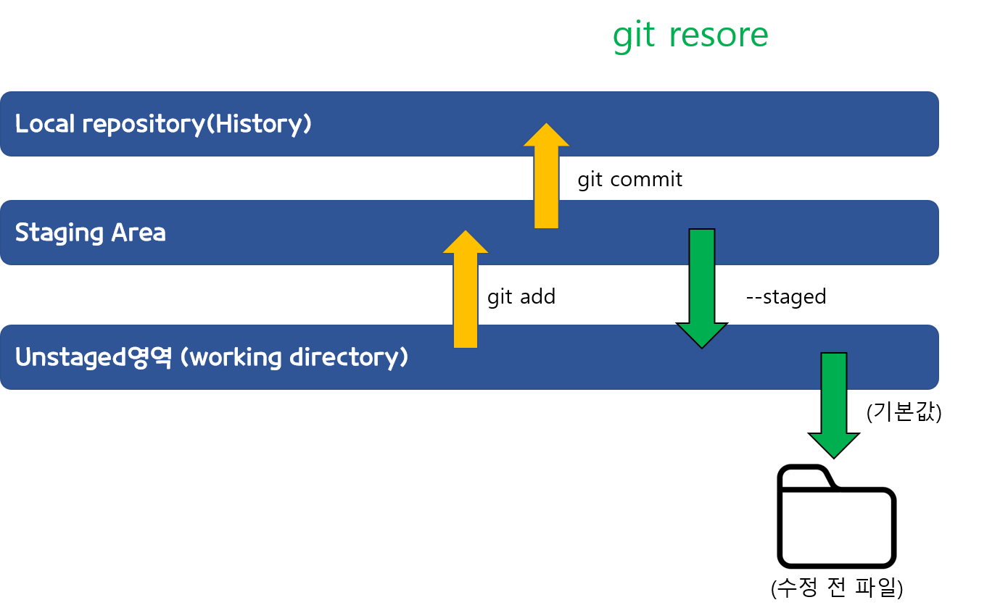
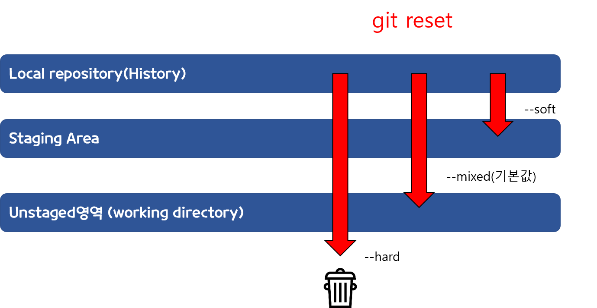

#  Git 명령어 정리  
### clone 
- 다른 외부 repository를 복사하여 해당위치에 다운로드 한다. 
   - 로컬저장소 혹은 원격 서버 저장소에도 복제 할 수 있따.  
- `git clone url주소`
### status 
- 현재 git 이 관리하는 영역에서 수정된 파일의 현황을 알려 준다. 
- `git status`   
### restore 
 - 아직 add 되지않은 Local Repository의 변경 사항을 폐기할 수 있다.(add 된 파일은 폐기되질않는다.) 
 - `git restore 파일경로/파일명`
 - 만약 add되어 Staging Area에 올라간 파일은 Unstaged 영역으로 복구시키는 옵션  `--staged`를 넣어주면 된다.

### add
- 내 로컬의 untracked file을 Git의 관리하인 Staging Area로 추가해 준다.
- `git add 파일명`으로 원하는 파일을 추가할 수 있다.
   - `git add .` 혹은 `git add -a`으로 모든 파일을 한번에 추가 할 수 있다. 

### commit 
- Staging Area 에서 Local Repository로 추가해주는 명령어로, 변경 사항을 저장한다.
   - 저장할때 간단한 메모를 남겨, 어떻게 변경되었는지 기록하고 관리할 수 있다.
   - 가장 많이 쓰는 명령어는 `git commit -m "메시지내용"` 이다. 
   - 여기서 메모하는 내용은 변경 기록내용을 봐야하기에, 쓰는 요령(컨텐션)이 따로 몇몇 있다. 

### reset 
- 특정 지점으로 되돌아 가는 명령어 이다.
- `git reset [--옵션] HEAD^ 숫자`
   - `HEAD`는 현재를 나타내며 `^` 혹은 `~`은 이전을 나타내고, 뒤에 `숫자`를 적으면 숫자만큼 이전으로 되돌아 간다. 
   -  HEAD외에 main 혹은 다른 branch가 올 수 있다.
- 주로 사용하는 옵션은 `--mixed`, `--hard`, `--soft`로 3가지가 있고, 기본값은 `--mixed`이다.
   1. `git reset --hard`
      - 해당 commit ID의 상태로 작업한폴더와 Index영역 모두 초기화하는 옵션이다. 
      - 변경 이력 및 수정된 파일 전부 삭제된다.
     
   2. git reset --mixed
      - 옵션이 없으면 기본값으로, working directory(unstaged)영역으로 돌아간다. 
      - commit과 add만 삭제되고 수정한 파일은 그대로 남아있다.
   3. git reset --soft
      - staging Area 영역에 있었을 때로 돌아간다.
      - commit만 삭제되고, 수정된 파일은 add된 상태로 남아있다. 
      

### push 
 -

### pull
