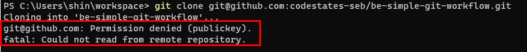
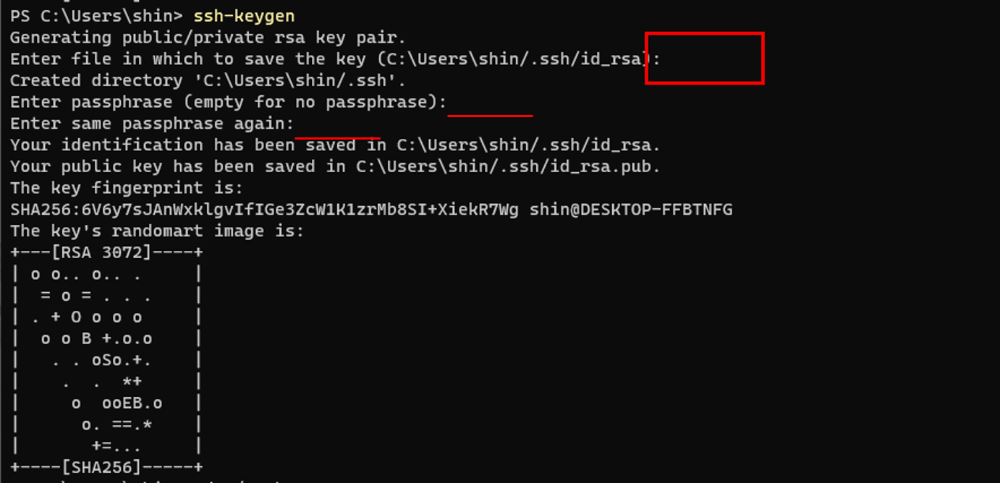

# 버전관리 시스템
 
 ## 버전관리를 사용하는 이유
  - 이전 버전으로 돌아갈 수 있다. 
  - 어떤 변경사항이 있는 지 알 수 있다.(전체적인 흐름파악)
  - 협업하기 좋다
  - 백업용(보험)

##  개발자 도구 Git 설치

### 1단계. git을 설치해준다. 
  -  window면 실행파일을 다운 받으면된다.
  -  Ubuntu라면 `sudo apt install git` 을 쳐주면 된다. 
  - 설치가 끝나면 `git --version` 명령어로 버전과 잘 설치가 되었는지 확인한다. 

### 2단계. 사용자 정보 입력
 - 가장먼저 사용자 이름과 이메일 주소를 설정해야한다.(gitHub에 등록된 이름과 이메일 주소)
    - `$ git config --global user.name 사용자 이름`
    - `$ git config --global user.email 이메일 주소` 
    -  `global` 옵션으로 설정하면, 사용자 홈에 저장되므로 git을 설정할 때 처음에 단한 번만 입력해도 된다. 
    -  대신, 사용자 이름과 이메일을 변경한다면 다시 입력해야 한다. 
 - 여러 프로젝트를 진행하고 있어서, 각 프로젝트 마다 사용자 이름이 다르다면, `- global` 옵션을 빼고 실행할 수 있다. 

#### 그럼 Global config와 일반 config의 차이는 뭘까?

### 3단계. 에디터 바꾸기. 
 - Git에서 **커밋메시지**를 기록할 때, **merge Commit**을 확인메시지가 나올때, 텍스트 에디터가 열리는데, 이 에디터를 바꿔줄 수가 있다.
 - `$ git config --global core.editor 에디터이름`명령어 한번이면 된다. 

### 4단계. SSH 등록
 - 먼저 SSH에 대해 알아보자면
#### SSH key란? 
- Secure Shell의 줄임말으로 추가인증 방법중 하나로
- 서버에 접속 할 때 비밀번호 대신 key를 제출하는 방식!
#### 동작원리 
 - 기본적으로 공개키는 리모트 머신(원격으로 다룰 서버와 같은)에 위치해야 하고, 비공개 키는 로컬 머신에 위치해야한다.
 - SSH 접속을 시도하면 SSH Client가 로컬머신의 비공개키와 원격머신의 공개키를 비교해서 일치하는 지를 확인!
 - 일치하면 접속이되고, 일치하지 않으면 접속이 되지않는다. 
 - 즉, 원격머신(gitHub)에 public키가 없거나, 로컬머신(작업 컴퓨터)에 private 키가 없으면 접속할 수 없다.
 

### SSH key 사용방법
 - `ssh-keygen` 명령어를 통해  키값을 생성할 수 있으며, 이후 나오는 입력창 3가지가 나오는데

 
    1. 키를 저장할 경로 및 파일명(기본값 : $HOME/.ssh/id_rsa)
    2. 추가 비밀번호(기본값 없음) :  굳이 입력안하고 엔터 눌러도 된다/
    3. 비밀번호 확인 : 2번과 같다. 
 - 만약 1번에 아무것도 입력하지 않았으면, 기본값인 `id_rsa` 파일과 `id_rsa.pub`파일이 생성되었을 것이다. 
   1. id_rsa : private key를 담고 있는 파일로 굳이 건들지 않아도 된다. 

