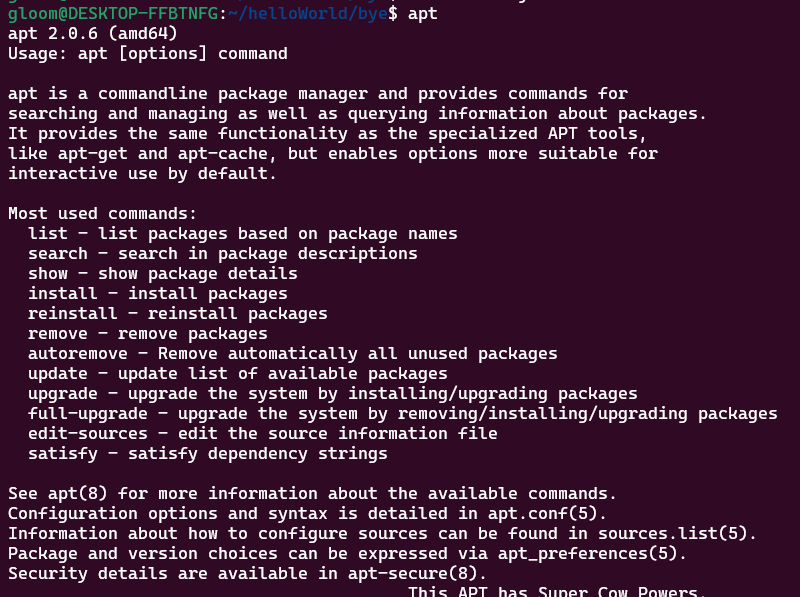

# 패키지와 패키지매니저 
- 패키지는 여러 파일이 담겨있는 하나의 상자
  - 패키지 구성 요소 : 프로그램 파일, 프로그램 설치 파일 프로그램 설치 설명서, 프로그램에 대한 정보를 담는 파일 등 

- 패키지 매니저는  설치, 변경, 삭제 등 관리를 편하게 해주는 도구 이다.
  - 모든 패키지의 저장소 위치를 저장하고 있다.  
  - 설치된 모든 프로그램의 업데이트를 확인하거나, 필요없는 걸 제거하는 데도 사용할 수 있다.
 
 

## 리눅스 기반 운영체제에서 사용하는 패키지 매니저 apt 
 - 우분투는 기본적으로 **apt라는 패키지 매니저가 내장**되어 있다.
 - `apt`라고 명령어에 치면 아래와 같이 설명문이 나온다. 
 

### apt 패키지 매니저 주요 명령어 
 - `apt update` : 패키지 목록 갱신 **관리자권한필요!!**
    - 설치된 프로그램이 새로운 버전으로 변경되는 것이 아님
    - 패키지 정보를 업데이트하는것이라, 업그레이드 가능한 것이 무엇이 있는지, 확인할 수 있게 된다.  
 - `apt list --upgradable` : 업그레이드 가능한 패키지 목록을 출력
    - 개인적으로 해보았는데, 리스트에 python이 눈에 들어온다.
    - 우분투는 기본적으로 python이 설치되어 있다? 아니면, 전에 설치했던것이 접근되는 것인가?
 - `apt upgrade` : 전체 패키지 업그레이드(버전업) , **관리자권한필요!!**
 - `apt --only-upgrade install 패키지 이름` : 특정 패키지만 업그레이드(버전업) **관리자권한필요!!**
 - `apt install 패키지 이름` : 패키지 설치
 - `apt show 패키지 이름` : 패키지 정보 확인
 - 'apt list --installed' : 설치된 패키지 보기 
 - 그외 `search` `remove` 검색과 삭제가 있다. 

### wget? 
리눅스 패키지중에서 가장 많이 사용되는 패키지이다. 
 - HTTP/FTP를 사용해서 서버에서 파일을 내려받기위한 패키지. 즉, 웹(URL)에서 파일 다운로드할 때 사용된다.

Ubuntu tip
> 복사 : `ctrl` +`shift` +`c`   
> 붙여넣기 : `ctrl` +`shift` +`v`

#### wget로 파일 다운받아 보기 
 - 파일명 : goodjob.txt
 - url :  https://bit.ly/37sJqCo   
 - 명령어 : `wget -O goodjob.txt https://bit.ly/37sJqCo`
