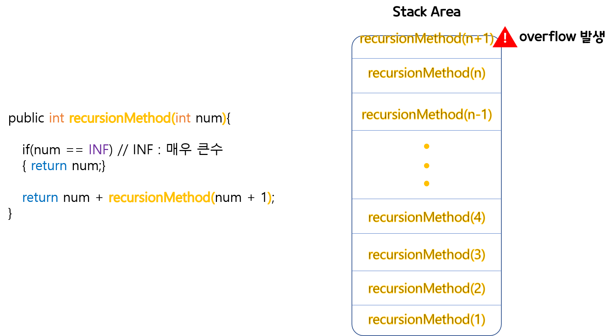
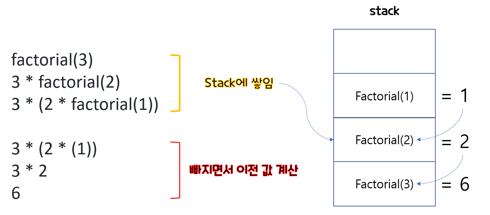
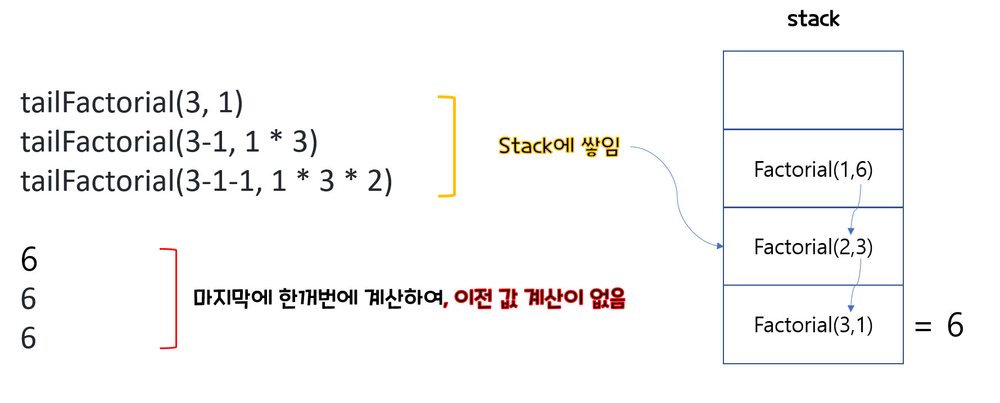

# 재귀(Recursion)함수
꼬리재귀를 들어가기 전, 재귀함수가 무엇인지 간단하게 짚고 넘어가자
- 재귀함수란? **자기 자신을 호출하는 함수**이다. 
- 구조는 비슷하지만, 더 작은 문제로 쪼갤수 있는 문제를 풀 때 매우 유용한 접근 방법이 되기도 한다.
- 반복문으로도 구현할 수도 있지만, 보다 코드도 짧아지고 내용도 꽤 직관적으로 파악할 수 있어서, 가독성도 좋은 편이다.
- 그럼 메모리적으로는 어떠할까?

## 재귀 함수 메모리 
- 우선 함수가 한번씩 호출될 때마다, 메소드안에 메소드라는 변수이기에 `Stack`이라는 데이터 저장공간에 보관된다.
- 보관되는 값은 `입력값` ,`결과값` 그리고 리턴 후 `돌아갈 위치`등 이 있다.
- 그렇기 때문에 재귀의 호출의 호출의 호출의 호출의... 호출은 Stack 메모리 공간을 금방 채워질 수가 있다.

- 위 처럼 공간이 다 차버리면 `스택오버플로우` 현상을 일으킬 수 있다. 생각보다 재귀함수가 위험성이 크다는 것이다.

<br></br>
## 꼬리 재귀(Tail Recursion)
- 그래서 위와 같은 단점을 보완하고, 재귀의 장점을 살린 방법 중 하나가 `꼬리 재귀`이다.
- 꼬리 재귀 :
    - 재귀 호출이 끝나면 아무 일도 하지않고 결과만 바로 반환되도록 하는 방법을 말한다.
    - 그래서 이전 함수의 상태를 유지하지않아도 되고, 추가연산을 하지않으니 스택이 넘쳐나는 현상을 해결할 수 있다.

- 꼬리 재귀 함수는 이름처럼 항상 함수의 꼬리부분에서 실행되는데, return되기 전에 값이 정해지며 호출당한 함수의 결과값이 호출하는 함수의 결과값으로 반환된다.

> 보다 더 자세한 이해를 위해 예시를 들어 비교해보자

<br></br>
<br></br>


# 재귀와 꼬리 재귀
재귀함수하면 유명한 `팩토리얼(!)`과 피보나치수열을 예시로 구현해보면서 
재귀함수와 꼬리재귀함수를 비교해보자 

## 팩토리얼(!)

### 일반재귀함수

```
    public int factorial(int n){
        if(n == 1){
            return 1;
        }
        return  n * factorial(n-1);
    }
```
예를 들어 n의 값으로 3을 넣었을때, 일반 재귀함수의 흐름은   
factorial(3)   
3 * factorial(2)  
3 * (2  * factorial(1))  
3 * (2  * (1))  
3 * 2  
6  
순으로 나열될 것이다.




### 꼬리재귀함수
```
    public int tailFactorial(int n, int total){
        if(n == 1){
            return total;
        }
        return  tailFactorial(n-1, total * n);
    }
```
tailFactorial(3, 1)   
tailFactorial(3-1, 1 * 3)   
tailFactorial(3-1-1, 1 * 3 * 2)   
tailFactorial(3-1-1, 1 * 3 * 2 * 1)   




## 정리 
 - 일반 재귀의 경우
     - 값을 다음 재귀함수에게 넘겨주고, 결과값을 넘겨 받으면 **그 값에 연산을 하고** 다른 함수에게 전달을 한다.
 - 꼬리 재귀의 경우
     - 값을 다음 재귀함수에게 넘겨주고, 값을 받아오기만 하지, **연산을 하지않는다.**   
 - 즉, 이둘의 차이점은 '**돌아갈 자리를 기억**하고 있는지 없는지 차이라는 것이다.'

<br></br>
<br></br>
## 피보나치
- 이번엔 피보나치수열을 한번 테스트해보자.
- JUNIT으로 테스트해보고 싶어서, Gradle도 설치해보았다.
### 일반 재귀의 경우


