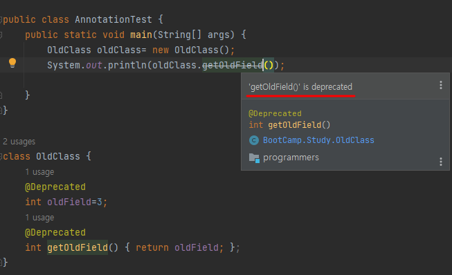

## 주석과 애노테이션
- 공통점 : 주석과 애너테이션은 모두 소스코드에는 아무런 영향도 미치지 않고, 정보를 제공하는 역할을 한다. 
- 차이점 : '누구에게 정보를 제공하는가' 의 차이가 있다.
    - 주석 : 소스 코드를 읽는 사람에게 정보 제공
    - 애너테이션 : 프로그램에게 정보 제공  

## 애노테이션의 역할
코드사이에 입력되는데, 프로그래밍 언어에 영향을 미치지 않으면서 **다른 프로그램에게 유용한 정보를 제공하는 역할**

- 컴파일러에게 문법 에러를 체크하도록 정보를 제공한다.
- 프로그램을 빌드할 때 코드를 자동으로 생성할 수 있도록 정보 제공
- 런타임에 특정 기능을 실행 하도록 정보 제공

## 종류
 - 표준 Annotation : 자바에서 기본으로 제공하는 `Annotation`
 
|Annotation notation|Detail|
|--|--|
|@Override|컴파일러에게 메서드를 오버라이딩하는 것이라고 알림|
|@Deprecated|앞으로 사용하지 않을 대상을 알릴 때 사용|
|@FunctionalInterface	|함수형 인터페이스라는 것을 알|
|@SuppressWarning|컴파일러가 경고메세지를 나타내지 않음|

- 메타 Annotation : `Annotation`에 붙이는 `Annotation`으로, `Annotation`을 정의할 때 쓰임

|Annotation notation|Detail|
|--|--|
|@Target|	애너테이션을 정의할 때 적용 대상을 지정하는데 사용한다.|
|@Documented	|애너테이션 정보를 javadoc으로 작성된 문서에 포함시킨다.|
|@Inherited	|애너테이션이 하위 클래스에 상속되도록 한다.|
|@Retention	|애너테이션이 유지되는 기간을 정하는데 사용한다.|
|@Repeatable	|애너테이션을 반복해서 적용할 수 있게 한다.|

- 사용 Annotation : 사용자가 직접 정의한 `Annotation`

---
## 애노테이션 테스트 

### @Deprecated

- @Deprecated 가 명시된 변수 혹은 메소드를 사용하면, 취소선이 쳐지고, 경고 문구가 나온다.
