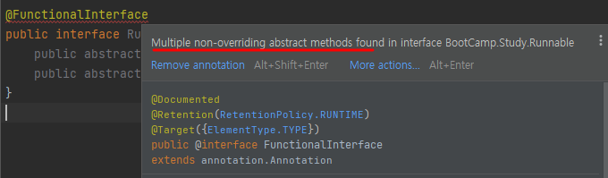

## 주석과 애노테이션
- 공통점 : 주석과 애너테이션은 모두 소스코드에는 아무런 영향도 미치지 않고, 정보를 제공하는 역할을 한다. 
- 차이점 : '누구에게 정보를 제공하는가' 의 차이가 있다.
    - 주석 : 소스 코드를 읽는 사람에게 정보 제공
    - 애너테이션 : 프로그램에게 정보 제공  

## 애노테이션의 역할
코드사이에 입력되는데, 프로그래밍 언어에 영향을 미치지 않으면서 **다른 프로그램에게 유용한 정보를 제공하는 역할**

- 컴파일러에게 문법 에러를 체크하도록 정보를 제공한다.
- 프로그램을 빌드할 때 코드를 자동으로 생성할 수 있도록 정보 제공
- 런타임에 특정 기능을 실행 하도록 정보 제공

## 종류
 - 표준 Annotation : 자바에서 기본으로 제공하는 `Annotation`
 
|Annotation notation|Detail|
|--|--|
|@Override|컴파일러에게 메서드를 오버라이딩하는 것이라고 알림|
|@Deprecated|앞으로 사용하지 않을 대상을 알릴 때 사용|
|@FunctionalInterface	|함수형 인터페이스라는 것을 알 수 있음|
|@SuppressWarning|컴파일러가 경고메세지를 나타내지 않음|

- 메타 Annotation : `Annotation`에 붙이는 `Annotation`으로, `Annotation`을 정의할 때 쓰임

|Annotation notation|Detail|
|--|--|
|@Target|	애너테이션을 정의할 때 적용 대상을 지정하는데 사용한다.|
|@Documented	|애너테이션 정보를 javadoc으로 작성된 문서에 포함시킨다.|
|@Inherited	|애너테이션이 하위 클래스에 상속되도록 한다.|
|@Retention	|애너테이션이 유지되는 기간을 정하는데 사용한다.|
|@Repeatable	|애너테이션을 반복해서 적용할 수 있게 한다.|

- 사용 Annotation : 사용자가 직접 정의한 `Annotation`

---

## 애노테이션 테스트 

<br></br>
 
### @Deprecated

- @Deprecated 가 명시된 변수 혹은 메소드를 사용하면, 취소선이 쳐지고, 경고 문구가 나온다.

<br></br>

### @FunctionalInterface
\[Runnable.java\]
```
@FunctionalInterface
public interface Runnable {
	public abstract void run ();
    public abstract void win ();
}
```


 - 함수형 인터페이스를 선언할 때, 확인하기위해 사용된다. 
 - 물론 애너테이션을 붙이지않아도 선언할 수 있지만, 실수를 방지 하지위한 확인용이다. 
 - 함수형 인터페이스는 하나의 추상메소드만 있어야 한다.
    - 만약 2개이상인 경우 에러를 발생시킨다.
 <br></br>
 
 ### @SuppressWarnings
- 선언한 곳의 컴파일 경고를 나타나지 않도록 한다.
- `@SuppressWarnings` 뒤에 괄호를 붙이고 그 안에 억제하고자 하는 경고메세지를 지정해줄 수 있다

|--|--|
|--|--|
|@SuppressWarings(”all”)	|모든 경고를 억제||
|@SuppressWarings(”deprecation”)|	Deprecated 메서드를 사용한 경우 나오는 경고 억제|
|@SuppressWarings(”fallthrough”)|	switch문에서 break 구문이 없을 때 경고 억제|
|@SuppressWarings(”finally”)	|finally 관련 경고 억제|
|@SuppressWarings(”null”)	|null 관련 경고 억제|
|@SuppressWarings(”uncheched”)|	검증되지 않은 연산자 관련 경고 억제|
|@SuppressWarings(”unused”)	|사용하지 않는 코드 관련 경고 억제|

<br></br>

### @Target 
- 애너테이션을 정의해주는 메타 애너테이션중 하나로, 적용범위를 지정해준다. 
- 보통 `@customAnnotation`을 만들때 `@Target`으로 적용대상을 정해줄수 있다.
- 보통 `Annotation`은 class나 Method에 선언하는데,예를 들어
  - 그 class안에 필드에만 적용하고싶을때 `@Target({FIELD, TYPE_USE})` 식으로 범위를 지정해준다.
```
@Target({FIELD, TYPE_USE})	// 적용대상이 FIELD
public @interface CustomAnnotation { }	// CustomAnnotation을 정의

@CustomAnnotation	// 적용대상이 TYPE인 경우
class Main {
    @CustomAnnotation	// 적용대상이 FIELD인 경우
    int i;
}
```
<br></br>

### @Documented
- 애너테이션에 대한 정보를 표기할 때 사용
- 보통 `@Override`와 `@SuppressWarnings`를 제외하고는 모두 @Documented가 적용

<br></br>

### @Inherited
- 하위 클래스가 애너테이션을 상속받도록 한다. 

