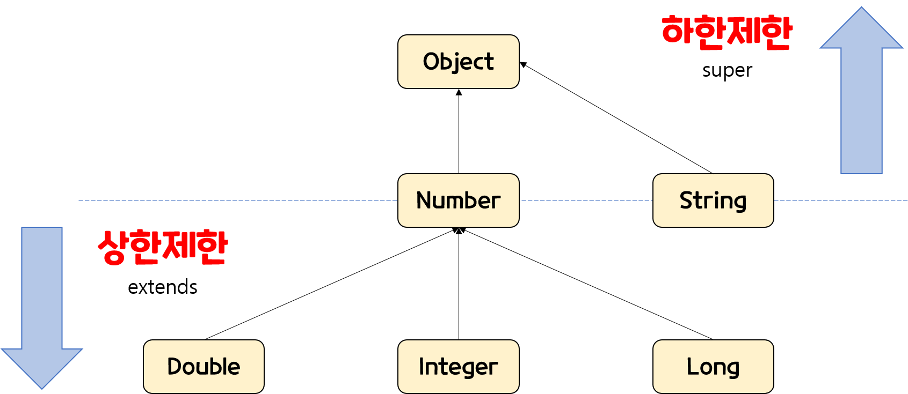

# 제한된 와일드 카드 
- 이를 통해 논리적인 오류까지 잡아 낼 수 있다.
- 상한제한`extends`과 하한 제한`super`이 있다.
  - 참고로 제네릭은 제한하는 방법은 `extends` 상한 제한 밖에 없다.


## wildCard의 상한 제한
```
public static void peekBox(Box<? extends Number> box) { 
    System.out.println(box); 
}

```
### 코드 해석 
 - 위 코드는 제네릭 타입이 `?` 즉, 와일드 카드만 있으면 어떠한 타입이 와도 상관은 없다. 
 - 하지만 뒤에  `extends Number`으로 제한을 걸었다.
   - 이덕에,`Box<type 넣을곳>` 의 type으로 Number이거나, Number를 상속하는 클래스만 들어가야한다. 

```
public static void main(String[] args) {
    peekBox(new Box<String>());   //타입 오류
    peekBox(new Box<Integer>()); // 정상 작동
}
```
 - 이것이 상한제한이다. 왜냐하면, Number클래스가 아닌 String클래스가 올 수 없는 것은 물론이고, 상위 클래스인 Object클래스도 올 수 없기 때문이다.


## wildcard의 하한 제한

```
public static void peekBox(Box<? super Number> box) { 
    System.out.println(box); 
}
```
### 코드 해석 
 - 위 코드도 제네릭 타입이 `?` 즉, 와일드 카드만 있으면 어떠한 타입이 와도 상관은 없다. 
 - 하지만 뒤에  `super Number`으로 제한을 걸었다.
    - 이 덕에 타입이 Number이거나 Number가 상속하는 클래스만 들어가야한다. 
```
public static void main(String[] args) {
    peekBox(new Box<Integer>());   //타입 오류
    peekBox(new Box<Object>()); // 정상 작동
}
```
 - 이것이 하한제한이다. Number클래스 보다 하위 클래스들은 올 수 없기 때문이다.
 - 게다가 이 기능은 일반 제네릭에는 없는 기능으로 wildCard로 인해 보다 논리적으로 타입을 제한해줄 수 있다.



<br></br>

## 어디에 사용될까?
요점 부터 정리하자면 
  - `extends` 는 값을 꺼내는 것은 되지만, 다시 넣는 것을 제한 할때 사용하고
  - `super`는 값을 넣는 것은 되지만, 값을 꺼내는 것이 제한해야 할때 사용한다. 
 
