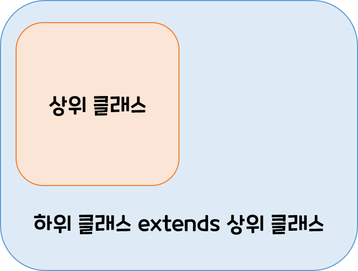
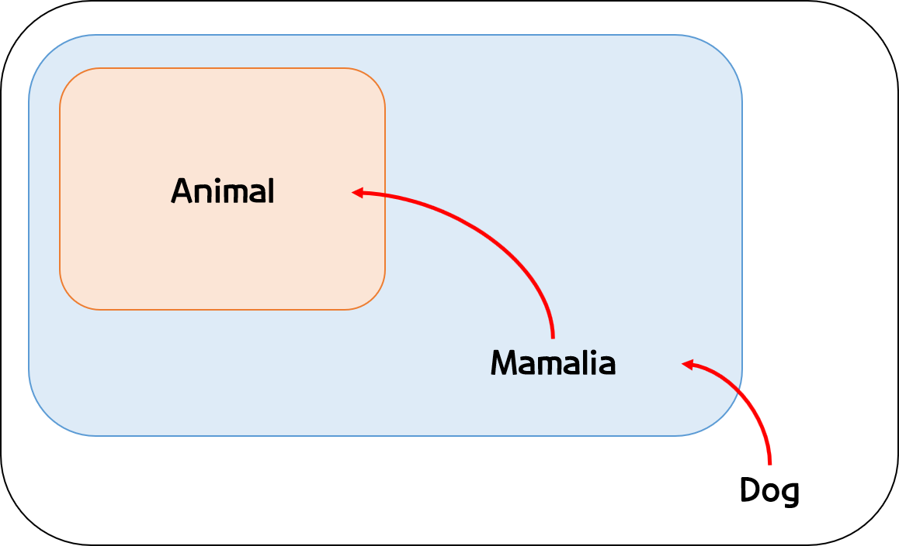
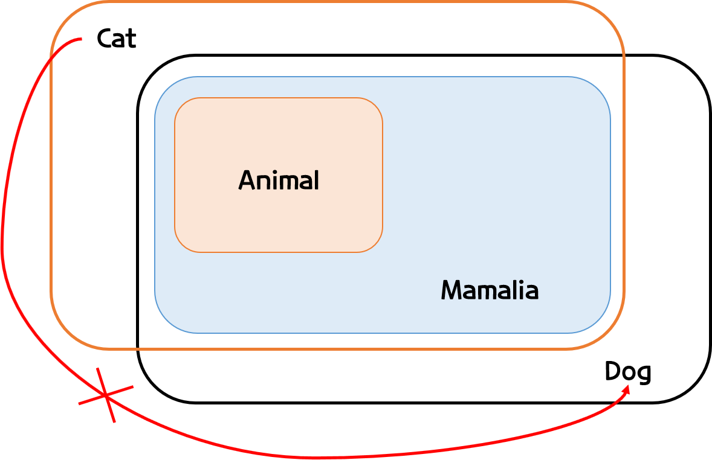
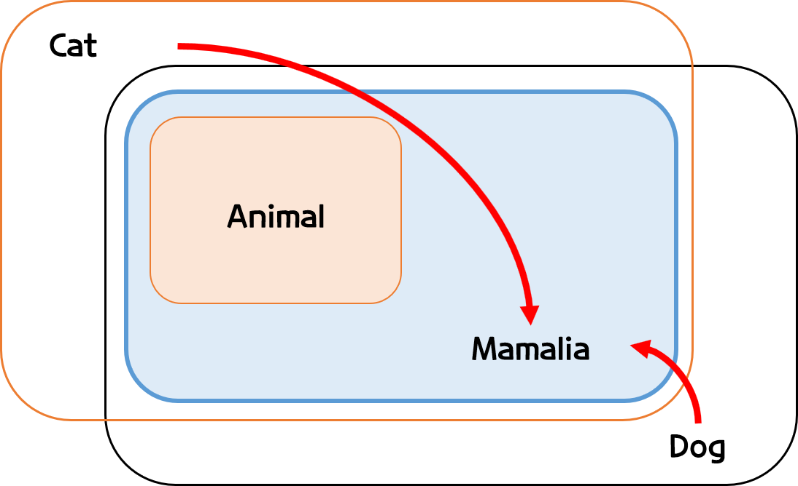
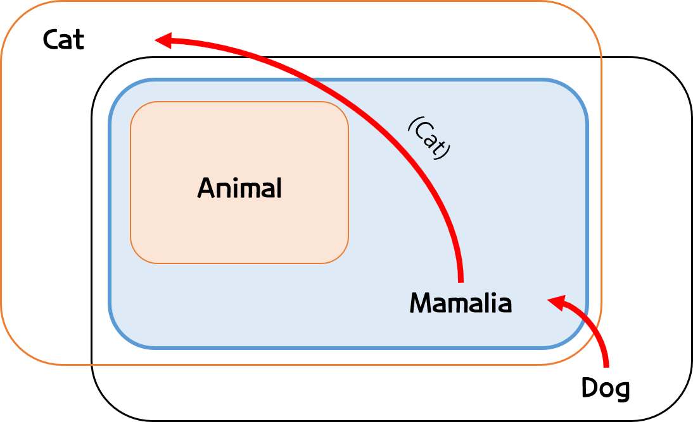
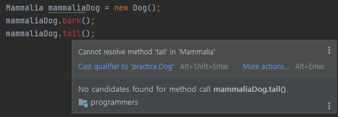

# [문제 발생한 곳으로 이동!](#변환-테스트3)

# 다형성
> 다형성이란 하나의 객체가 여러가지 형태를 가질 수 있다는 것을 의미한다.    
> 자바에서 다형성은 한 타입의 참조변수를 통해 여러 타입의 객체를 참조할 수 있도록 만든 것을 의미한다. 
- 구체젝인 예시를 들어 이해해보자

## 참조변수 예시
-  상위 클래스 타입의 참조변수를 통해서 하위 클래스의 객체를 참조할 수 있도록 허용한 것
-  유의사항으로는 참조변수가 사용할 수 있는 멤버의 개수는 실제 객체의 맴버 개수보다 같거나 적어야 한다는 점!!

<p align= center></p>

```
class Animal{
    public void move(){
        System.out.println("움직이는 동물입니다.");
    }
}

class mammalia extends Animal{
    public void haveBaby(){
        System.out.println("자식을 새끼로 낳습니다.");
    }
}
class dog extends mammalia{
    int size;
    int name;
    public void haveBaby(){
        System.out.println("강아지새끼를 낳습니다.");
    }
    public void bark(){
        System.out.println("멍멍!");
    }
    public void tail(){
        System.out.println("꼬리를 흔듭니다.");
    }
}
```
위와 같이 동물(Animal), 포유류(Mammalia),강아지(Dog)클래스를 만들어주고,    
상위 클래스인 동물(Animal)에 하위클래스인 강아지(Dog)를 참조할 수 있다.

```
public class polymorphism {
    public static void main(String[] args) {
        Animal animal = new Dog();  // 가능
        Dog dog = new Animal(); // 불가능 
    }
}
```
## 참조변수의 변환 
> 위와 같이 참조가 가능한 이유는, 강아지(Dog)클래스 보다, 동물(Animal)클래스가 상위에 있어서   
> 동물(Animal)클래스가 필요한 것들을 강아지(Dog)클래스가 다 가지고 있기에 가능한 일이다.

### 참조변수의 변환 예시 
 - `mammalia`는 `Dog`보다 상위 클래스이기에, `mammalia`로 참조변수가 가능하다.
 - 거기에 한번더 `animal`도 ``mammalia`보다 상위 클래스이기에, 아무런 변환 없이 참조가 가능하다. 
 
<p align= center></p>

```
public class polymorphism {
    public static void main(String[] args) {
        Mammalia mammalia = new Dog(); // Dog -> Mammalia 
        Animal animal = mammalia;   //   Mammalia -> Animal
    }
}
```

<br></br>

- 그럼 강아지(Dog)클래스 말고 고양이(Cat)클래스를 만들어보자

[고양이 클래스]

```
class Cat extends Mammalia{
    int size;
    int name;
    public void haveBaby(){
        System.out.println("고양이새끼를 낳습니다.");
    }
    public void bark(){
        System.out.println("냐옹!!");
    }
    public void attack(){
        System.out.println("앞발를 들어 휘두릅니다.");
    }
}
```
 - 고양이도 포유류이기에 Mammalia 클래스를 상속받은건 똑같지만, 강아지 클래스랑 다르게, `brak()`는 `냐옹!`울고, `attack()`이라는 다른 메소드를 넣었다.
 - 엄연히 고양이(Cat) 와 강아지(Dog)는 다른 클래스이다.
    - 하지만, 둘다 똑같이 `Mammalia`를 상속 받고있다. 
    - 그럼 변환이 가능하지 않을까❓

<br></br>

### 변환 테스트

<p align= center></p>

```
        Dog dog =new Dog();
        Cat cat = new Cat();
        cat = (Cat)dog;  // Inconvertible types 에러
```
 - `ClassCastException`에러와 함께 당연히 **전환할 수 없는 타입**이라는 에러가 나온다.

<br></br>


### 변환 테스트2

<p align= center></p>

```
        Mammalia mammaliaDog = new Dog();
        Mammalia mammaliaCat = new Cat();
        mammaliaCat = mammaliaDog; // 오류가 나질 않는다
```
 - 예상했던데로 오류가 나지않고 잘 변환된다. 
 - 그럼 원래 고양이(Cat)클래스안에 있던 데이터들은 어떻게 되었을까❓

<br></br>

### 변환 테스트3 
# 문제 발생한 곳

<p align= center></p>

```
        Mammalia mammaliaDog = new Dog();
        Cat cat = (Cat)mammaliaDog; 
        // 컴파일시 오류가 발생한다. 
```
- 위와 같은 경우는 `ClassCastException`이 일어난다. 
- 이론상 완벽한데, 왜 에러가 나타나는 걸까요❓❓ 

### 에러내용확인
`class practice.Dog cannot be cast to class practice.Cat (practice.Dog and practice.Cat are in unnamed module of loader 'app'`
- 대충 요약하자면 Dog를 Cat에 캐스팅할 수 없다.(서로 이름없는 모듈을 불렀습니다.)

### 해결책
 - `new`로 새로 만들어주면 해결가능하긴하다. 
     - 물론 `new`로 생성해주는 것이기에, 클래스 Cat안에 cat(Mammalia m)생성자를 추가로 만들어줘야한다. 

- Cat Class
```
class Cat extends Mammalia{
    int size;
    int name;
    public Cat(){}        // 추가코드
    public Cat(Mammalia mammaliaDog) {}  //추가코드
    public void haveBaby(){
        System.out.println("고양이새끼를 낳습니다.");
    }
    public void bark(){
        System.out.println("냐옹!!");
    }
    public void attack(){
        System.out.println("앞발를 들어 휘두릅니다.");
    }
}
```
- Main 메소드
```
        Mammalia mammaliaDog = new Dog();
        Cat cat = new Cat(mammaliaDog);   // 오류없이 해결
```
### 하지만 아쉽게도..
 - 다운캐스팅으로 해결하고 싶은데.. 그 방법은 아직 찾지못했다..

<br></br>

## 상위 클래스로 참조한 변수 확인



```
        Mammalia mammaliaDog = new Dog();
        mammaliaDog.haveBaby();  // "강아지새끼를 낳습니다." 출력
```
- 원래 `Mammalia` 클래스에 있는 메소드는 실행가능하다.
- `Mammalia` 에도 `haveBaby()`가 있지만, `Dog()`로 선언하였기에, `Dag.haveBaby()`로 불러 진다.

<br></br>


## 결론 
- 하위 클래스를 통해서 상위 클래스 타입의 참조변수를 생성할 때 
     - 겹치는 변수나 메소드가 있다면, 자동 덮어씌우기 (`override`) 이 되고
     - 겹치지 않는 것 있다면, 저장되지 않는다.  


