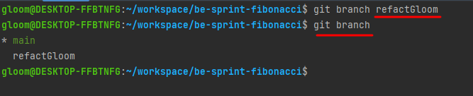
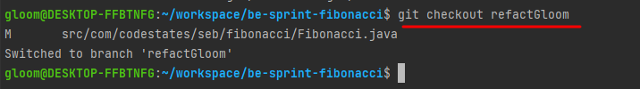
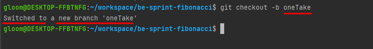
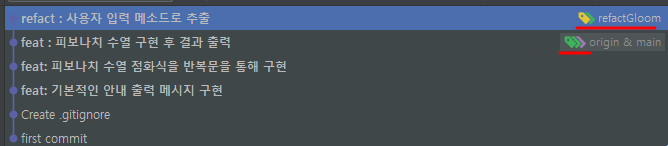
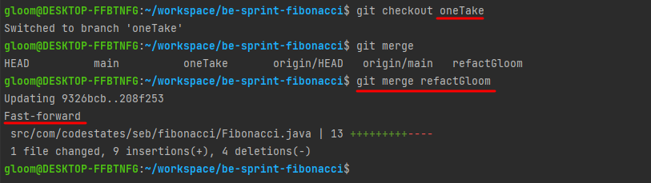
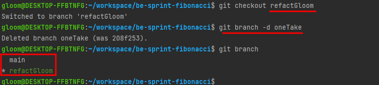
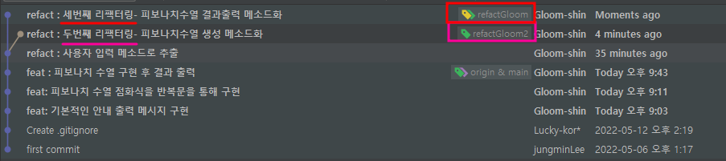

## 브랜치 만들기 
> git branch "branchname"

### 예시 
 -  `git branch refactGloom` 입력하면, **새로운 브랜치**를 만든다.
 - `git branch` 만 입력하면, 현재 생성되어 있는 **브랜치들을 출력**한다.
 
 

## 브랜치 전환하기
 - 하지만, 위의 사진을 보면 `* main` 으로 되어 있고,새로운 브랜치앞엔 아무것도 없는 걸 알 수 있다.
 - 이 별`*`은 현재 선택된 브랜치를 말한다.
 - 그럼 새로운 브랜치를 선택하려면 어떻게 해야될까? 

 > git checkout "branchname"

### 예시 
 
 
  - 꿀팁으로, 브랜치를 생성하고 전환하는 작업을 한번에 실행할 수도 있다. 
> git checkout -b "branchname"

 

## 추가되는 커밋
 - 새로운 브랜치를 만들고 전환까지 완료한 상태에서, 커밋(commit)을 하게되면 현재까지 상태에서 해당 브랜치에서만 기록이 된다.

### 예시 
 

## 브랜치 병합하기 
 - 병합은 merge 명령어로 실행된다. 
 - 하지만 여기서 헤깔릴 수도 있는 것이, 현재 가리키고 있는 브런치를 덮어씌우는 것이다.

> git merge "앞써간 커밋 혹은 브랜치"

 

- 이렇게 되면, `oneTake`브랜치가 가리키는 커밋이 `refactGloom`과 같은 위치로 이동하고
- 현재 가르키는 브랜치은 그대로 `oneTake` 이다.
- 이런 방식의 병합을  `fast-forward (빨리감기) 병합` 이라 한다.

## 브랜치 삭제하기 
 - 하지만, `oneTake`브랜치가 필요없다면 삭제할 수 도 있다.
 - 생성할 때랑 반대로 `-d`로 해주면 된다. 
 - 만약 삭제하려는 브랜치가 현재 가르키는(선택된) 상태라면 삭제가 불가능 하다. 
> git branch -d "branchname"

 
 
 ## 동시에 여러 작업하기
  - 브랜치를 활용하면, 작업을 나눠서하거나, 다른 방법으로 작업을 해보기 좋다.

 
 ### 병합할 때 충돌
  - 하지만, 위와 같은 2가지의 경우 병합(Merge)을 할 경우 충돌이 일어나게 된다.
  - 이럴경우, 둘 중 하나를 합칠수 있게 고쳐주면된다.(수동 병합해야된다는 것)
  - 하지만, 수동의 경우 시간도 오래걸리고 불편하니 다른 방법이 없나 알아 보자

# Merge 종류
- 개인 로컬에서의 Merger는 자동병합이 된다.
- 하지만,  GitHub Pull Request 에서도 Merge를 할 수가 있는데, 총 3가지 종류가 있다. 

## Create a Merge Commit
 > 추후 실습해보자
## Squash and Merge
 > 추후 실습해보자
## Rebase and Merge
 > 추후 실습해보자
