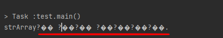
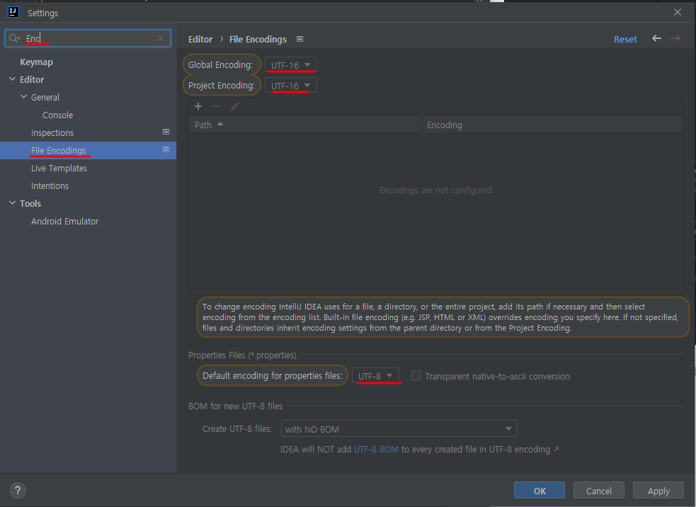
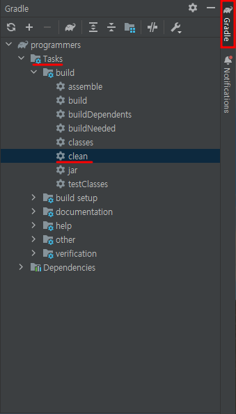
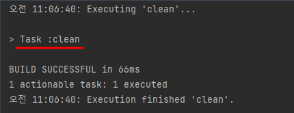
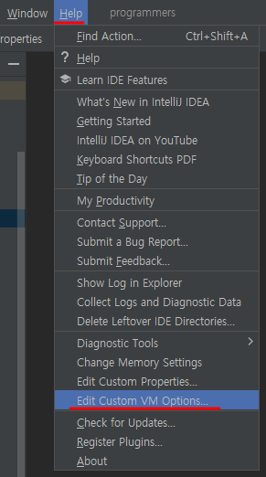
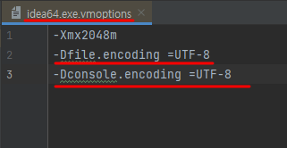
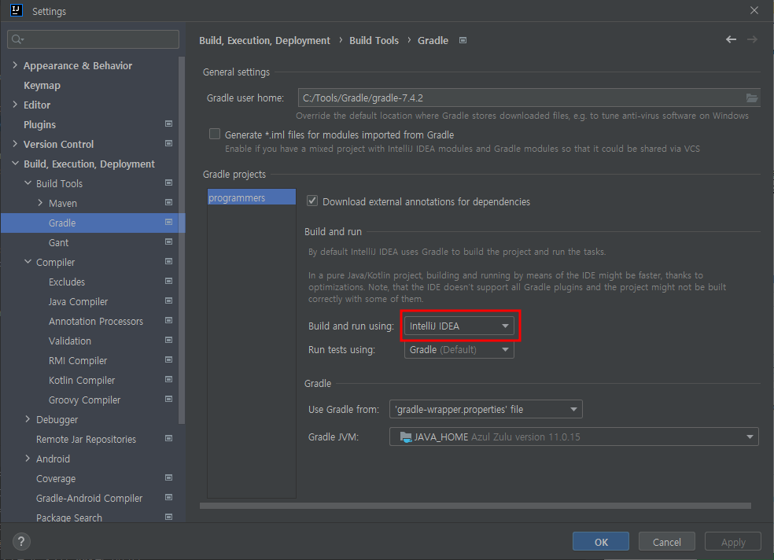

IntelliJ를 실행시켜보면 한글이 깨지는 에러가 나는 상황이 종종있다. 
에러 메시지도. 한글 출력을 따로 하지않았고, 주석에 한글이 있어도  
`error: unmappable character (0xEC) for encoding x-windows-949`
라는 에러가 뜬다. 

### 예상하는 원인1
 - 에러메시지의 원인을 보면 window에서 인코딩에 사용할 수 없는 문자라는 내용이다. 
 - 즉, 현재 IntelliJ의 **인코딩 설정값**을 확인해보자.

## 해결법1 
 - `File` -> `Setting` -> 검색창
 - "Encoding"입력 -> `File Encodings`
 - 위 경로따라 메뉴로 들어오면, 인코딩값을 수정할 수 있는 3가지 메뉴가 나온다. 

 - windows의 기본 설정이 ms949인코딩으로 설정되어 있기 때문에, 한글을 읽을 수가 없다. 
 - 그래서 `UTF- 8(권장)` 혹은 `UTF- 16`로 변경해주면, 인코딩 문제가 해결된다. 

  
  

### 그래도 발생하는 에러
`error: unmappable character (0xED) for encoding x-windows-949? ��?��?�� ?��?�� �?`

  

### 예상하는 원인2
 - 인코딩 설정을 바꾸고, 인텔리J도 껐다 켰는데도, 아직도 똑같은 오류가 뜬다는 것은   
 - **기존의 빌드했었던 파일(잔여물)이 남아있을 가능성**이 있다.
    - 인코딩 설정을 바꾸기 전에, 빌드를 진행하여, 이전 빌드가 남아 있거나
    - 중간에 빌드툴을 바꾸게되어, 이전 빌드툴의 잔여물이 남아있을 경우 
  
> 그럼, 현재 Build 파일(잔여물)을 확인해보자!

## 해결법

 - 오른쪽 메뉴바 상단의 - `Gradle` 클릭 
 - `Tasks` -> `build` -> `Clean` 클릭
 - 위 경로따라 클릭을 하면, Gradle툴이 build했었던 작업을 깨끗하게 정리한다. 

 - 하지만 이것 역시 Gradle이 관리하는 build파일들만 해당되며, 이전에 있었던 빌드 파일들은 정리되지 않는다. 

## 해결법2 
 > 해결법1은 어차피 `Gradle툴` 관리하에 build된 파일들을 삭제하는 것이였기에    
 > 해결법2은 `Gradle툴` 관리 밖에 있는 build된 파일들을 삭제하는 것이다. 

- 왼쪽 메뉴바 상단의 - `project` 클릭
- `build` 폴더를 찾는다. 
- `build` 폴더를 삭제한다. 
   - 그러고  상단 메뉴바에서 Build -> Rebuild Project 를 클릭하여 해결한다. 
   - 혹은 인텔리J를 재시작 한다.
- 하지만, 이것도 에러가 발생할 수 있다. 빌드영역이 아닌 컴파일러 영역에서 에러가 난 것일 수도 있다.
- `Execution failed for task ':compileJava'.`

  
  

### 예상하는 원인3
 - 컴파일러가 제대로 작동을 안하는 것이 아닐까? 하여, 이번엔 **컴파일러**를 뒤져보기러 한다. 
 - 컴파일러 영역은 VM의 영역이라서, 인위적으로 설정값을 변경해줘야 된다. 
 - 그럼 Compiler의 설정을 확인해보자 
 
## 해결법
> java의 컴파일러는 javac로 JDK안에 포함되어있다.   
> 그래서 JDK버전이 다르면, javac의 내용도 다를수 있으니,   
> IntelliJ의 project가 사용하는 JDK, 빌드가 사용하는 JDK, Compile JDK를 맞출 필요가 있다.
> 위를 적용했음에도 안된다면, javaC 자제를 수정해주자.

 - 상단의 메뉴에서 `Help` 클릭
 - `edit Custom VM options` 클릭!
 - 그럼 아래와같이 `idea64.exe.vmoptions` 파일이 열린다.(32bit면 idea32..로 뜬다고 한다.)

  - `Dfile.encoding =UTF-8` , `Dconsole.encoding =UTF-8` 추가 해주자.

  - 하지만..그런데도 해결이 안될 수 있다.

  
  

### 예상치 못한 원인
 - 왜 이게 해결되었는지 모르겠다. 
 - 하지만, 이 방법까지 하면 Run혹은 Build 실행시 오류는 뜨지않는다. 

## 해결법
- `File` -> `Setting`
- `Build, Execution, Deployment` -> `Build Tools` -> `Gradle`
- 메뉴창에서 Gradle projects 중에 , `Build and Run using`의 상태를 
    - `Gradle(Default)` 에서 `IntelliJ IDEA`로 바꿔주면 해결된다. 
     

