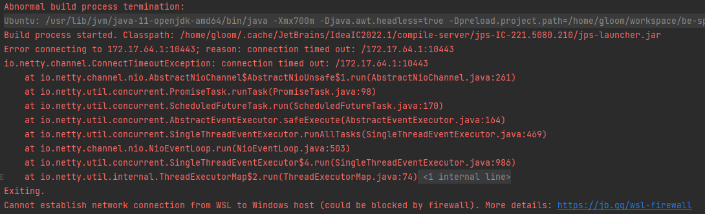
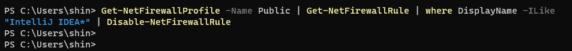

## 에러코드

실제 오류 메시지 


```
Abnormal build process termination: 
C:\WINDOWS\system32\wsl.exe --distribution Ubuntu --exec /bin/sh -c "cd /home/gloom/.cache/JetBrains/IdeaIC2022.1/compile-server && /usr/lib/jvm/java-11-openjdk-amd64/bin/java -Xmx700m -Djava.awt.headless=true -Dpreload.project.path=/home/gloom/workspace/be-sprint-fibonacci -Dpreload.config.path=/mnt/c/Users/shin/AppData/Roaming/JetBrains/IdeaIC2022.1/options -Dcompile.parallel=false -Drebuild.on.dependency.change=true -Djdt.compiler.useSingleThread=true -Daether.connector.resumeDownloads=false -Dio.netty.initialSeedUniquifier=7521009720181125419 -Djps.in.wsl=true -Dfile.encoding=x-windows-949 -Duser.language=ko -Duser.country=KR -Didea.paths.selector=IdeaIC2022.1 '-Didea.home.path=/mnt/c/Tools/IntelliJ/IntelliJ IDEA Community Edition 2022.1' -Didea.config.path=/mnt/c/Users/shin/AppData/Roaming/JetBrains/IdeaIC2022.1 -Didea.plugins.path=/mnt/c/Users/shin/AppData/Roaming/JetBrains/IdeaIC2022.1/plugins -Djps.log.dir=/mnt/c/Users/shin/AppData/Local/JetBrains/IdeaIC2022.1/log/build-log '-Djps.fallback.jdk.home=/mnt/c/Tools/IntelliJ/IntelliJ IDEA Community Edition 2022.1/jbr' -Djps.fallback.jdk.version=11.0.14.1 -Dio.netty.noUnsafe=true -Djava.io.tmpdir=/home/gloom/.cache/JetBrains/IdeaIC2022.1/compile-server/be-sprint-fibonacci_2fa2a3d1/_temp_ -Djps.backward.ref.index.builder=true -Dkotlin.incremental.compilation=true -Dkotlin.incremental.compilation.js=true -Dkotlin.daemon.enabled '-Dkotlin.daemon.client.alive.path=\"C:\Users\shin\AppData\Local\Temp\kotlin-idea-11927587621786101544-is-running\"' -Djps.kotlin.home=/home/gloom/.cache/JetBrains/IdeaIC2022.1/compile-server/jps-IC-221.5080.210/kotlinc -Dtmh.instrument.annotations=true -Dtmh.generate.line.numbers=true -classpath /home/gloom/.cache/JetBrains/IdeaIC2022.1/compile-server/jps-IC-221.5080.210/jps-launcher.jar org.jetbrains.jps.cmdline.Launcher '/home/gloom/.cache/JetBrains/IdeaIC2022.1/compile-server/jps-IC-221.5080.210/jps-builders.jar:/home/gloom/.cache/JetBrains/IdeaIC2022.1/compile-server/jps-IC-221.5080.210/jps-builders-6.jar:/home/gloom/.cache/JetBrains/IdeaIC2022.1/compile-server/jps-IC-221.5080.210/jps-javac-extension.jar:/home/gloom/.cache/JetBrains/IdeaIC2022.1/compile-server/jps-IC-221.5080.210/util.jar:/home/gloom/.cache/JetBrains/IdeaIC2022.1/compile-server/jps-IC-221.5080.210/util_rt.jar:/home/gloom/.cache/JetBrains/IdeaIC2022.1/compile-server/jps-IC-221.5080.210/annotations.jar:/home/gloom/.cache/JetBrains/IdeaIC2022.1/compile-server/jps-IC-221.5080.210/3rd-party-rt.jar:/home/gloom/.cache/JetBrains/IdeaIC2022.1/compile-server/jps-IC-221.5080.210/jna.jar:/home/gloom/.cache/JetBrains/IdeaIC2022.1/compile-server/jps-IC-221.5080.210/lz4-java.jar:/home/gloom/.cache/JetBrains/IdeaIC2022.1/compile-server/jps-IC-221.5080.210/protobuf.jar:/home/gloom/.cache/JetBrains/IdeaIC2022.1/compile-server/jps-IC-221.5080.210/jps-model.jar:/home/gloom/.cache/JetBrains/IdeaIC2022.1/compile-server/jps-IC-221.5080.210/javac2.jar:/home/gloom/.cache/JetBrains/IdeaIC2022.1/compile-server/jps-IC-221.5080.210/forms_rt.jar:/home/gloom/.cache/JetBrains/IdeaIC2022.1/compile-server/jps-IC-221.5080.210/aether-dependency-resolver.jar:/home/gloom/.cache/JetBrains/IdeaIC2022.1/compile-server/jps-IC-221.5080.210/idea_rt.jar:/home/gloom/.cache/JetBrains/IdeaIC2022.1/compile-server/jps-IC-221.5080.210/kotlin-jps-plugin.jar:/home/gloom/.cache/JetBrains/IdeaIC2022.1/compile-server/jps-IC-221.5080.210/javaFX-jps.jar:/home/gloom/.cache/JetBrains/IdeaIC2022.1/compile-server/jps-IC-221.5080.210/javaFX-common.jar:/home/gloom/.cache/JetBrains/IdeaIC2022.1/compile-server/jps-IC-221.5080.210/eclipse-jps.jar:/home/gloom/.cache/JetBrains/IdeaIC2022.1/compile-server/jps-IC-221.5080.210/eclipse-common.jar:/home/gloom/.cache/JetBrains/IdeaIC2022.1/compile-server/jps-IC-221.5080.210/space-java-jps.jar:/home/gloom/.cache/JetBrains/IdeaIC2022.1/compile-server/jps-IC-221.5080.210/java-guiForms-jps.jar:/home/gloom/.cache/JetBrains/IdeaIC2022.1/compile-server/jps-IC-221.5080.210/java-langInjection-jps.jar:/home/gloom/.cache/JetBrains/IdeaIC2022.1/compile-server/jps-IC-221.5080.210/groovy-jps.jar:/home/gloom/.cache/JetBrains/IdeaIC2022.1/compile-server/jps-IC-221.5080.210/groovy-constants-rt.jar:/home/gloom/.cache/JetBrains/IdeaIC2022.1/compile-server/jps-IC-221.5080.210/ant-jps.jar:/home/gloom/.cache/JetBrains/IdeaIC2022.1/compile-server/jps-IC-221.5080.210/maven-jps.jar:/home/gloom/.cache/JetBrains/IdeaIC2022.1/compile-server/jps-IC-221.5080.210/gradle-jps.jar:/home/gloom/.cache/JetBrains/IdeaIC2022.1/compile-server/jps-IC-221.5080.210/devkit-jps.jar' org.jetbrains.jps.cmdline.BuildMain 172.17.64.1 10443 fa29afd7-89e3-414c-a0e4-094f76c3b2f3 /home/gloom/.cache/JetBrains/IdeaIC2022.1/compile-server"
Build process started. Classpath: /home/gloom/.cache/JetBrains/IdeaIC2022.1/compile-server/jps-IC-221.5080.210/jps-launcher.jar
Error connecting to 172.17.64.1:10443; reason: connection timed out: /172.17.64.1:10443
io.netty.channel.ConnectTimeoutException: connection timed out: /172.17.64.1:10443
	at io.netty.channel.nio.AbstractNioChannel$AbstractNioUnsafe$1.run(AbstractNioChannel.java:261)
	at io.netty.util.concurrent.PromiseTask.runTask(PromiseTask.java:98)
	at io.netty.util.concurrent.ScheduledFutureTask.run(ScheduledFutureTask.java:170)
	at io.netty.util.concurrent.AbstractEventExecutor.safeExecute(AbstractEventExecutor.java:164)
	at io.netty.util.concurrent.SingleThreadEventExecutor.runAllTasks(SingleThreadEventExecutor.java:469)
	at io.netty.channel.nio.NioEventLoop.run(NioEventLoop.java:503)
	at io.netty.util.concurrent.SingleThreadEventExecutor$4.run(SingleThreadEventExecutor.java:986)
	at io.netty.util.internal.ThreadExecutorMap$2.run(ThreadExecutorMap.java:74)
	at java.base/java.lang.Thread.run(Thread.java:829)
Exiting.
Cannot establish network connection from WSL to Windows host (could be blocked by firewall). More details: https://jb.gg/wsl-firewall
```
- 엄청 길어지고 무언가 많은것처럼 느껴지지만, 간단히 요약하자면, 
- 인텔리제이가 비정상적인 빌드 프로세스로인해 종료됨

### 문제의 원인 
- 그래서 추천하는 해결방법은, `Cannot establish network connection from WSL to Windows host`

### 해결방법1 
- WSL에서 윈도우 호스트로의 네트워크 연결을 설정할 수 없으므로, WSL에 권한을 부여해주는 방법이다.
- 공식 사이트을 참고하였다. [jetbrains WSL 도움말 - 방화벽](https://www.jetbrains.com/help/idea/how-to-use-wsl-development-environment-in-product.html#debugging_system_settings)

1. Windows 터미널을 관리자 권한으로 실행
2. `New-NetFirewallRule -DisplayName "WSL" -Direction Inbound  -InterfaceAlias "vEthernet (WSL)"  -Action Allow` 명령어 입력
   - WSL을 사용자권한 연결을 허용한다.   

3. `Get-NetFirewallProfile -Name Public | Get-NetFirewallRule | where DisplayName -ILike "IntelliJ IDEA*" | Disable-NetFirewallRule` 명령어 실행 
   - 방화벽 규칙 갱신해준다.
   - 추가로 위 명령문관련 링크 [마이크로소프트 ](https://docs.microsoft.com/en-us/powershell/module/netsecurity/get-netfirewallrule?view=windowsserver2022-ps)



4. 인텔리제이를 다시 시작해주고, 방화벽 관련 팝업이 뜨면, 공용 네트워크 확인란을 선택한다.

 
   
   

