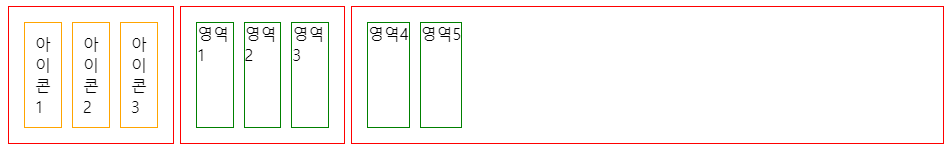

# HTML과 CSS 실습해보기 
- 코드 작성은 Codepen를 이용하여 작성하였다 .
- flexbox를 이용해 아래와같은 layout을 만들어 보고자 한다.

  <p align =center></p>
  
- 수평으로 크게 3개의 레이아웃으로 나눠져있고, 테두리가 빨간색 줄로 되어있다. 
- 각각의 레이아웃은 또 3개의 아이콘 혹은 영역들로 공간을 차지하고있다. 
- 아이콘은 주황색 테두리, 영역은 파란색테두리를 가지고 있다.

<br></br>
## 코드 작성

### 1. 먼저 틀부터 잡기 
 - 수평으로 크게 3개의 레이아웃으로 나눠지는 것 부터 잡아주고, 안에들어갈 내용들을 간단하게만 넣어주었다. 
 - 3개로 나누는 방법은 `id`를 사용해 각각  `left`, `middle`, `right` 로 정해줬다.
  <p align =center></p>

<div></div>

### 2.모든걸 담는 레이아웃부터 수정해주기
- 일단 들어갈 `content`들은 만들었지만, `left`, `middle`, `right`가 수평으로 정렬되어 있어야한다. 
    -  `flex-direction : row`로 수정
  <p align =center></p>

- 그리고 수평의 길이는 끝까지 채워졌으나, 수직의 길이는 content가 들어간 만큼뿐이니, 수직의 길이를 수정해주었다.
  - 하지만, height : 100%로 수정해도 크기는 변함이 없어, 방법을 찾아주니, 레이아웃의 부모들인 `html`과 `body`도 같이 설정해줘야되였다. 
```
html, body{
  height : 100%;
}
```
  <p align =center></p>
  
### 3. left, middle, right 레이아웃 수정해주기 
 - 각 레이아웃들을 flex로 만들어 줘야한다. 
 - 3가지 레이아웃 모두 'flex-direction : column` 으로  만들어준다.  
 - 각각 `flex-grow`을 왼쪽부터 1, 3, 7 로 나눠줬다.
 - 그리고 아이콘은 '.icon'로 class 를 만들고, 영역은 '.box'로 클래스를 만들어 줫다.
    - 추가적으로 보기좋게 `icon`과 `box`에 margin과 테두리는 먼저 넣어주었다.    
 
  <p align =center></p>

### 4.icon 과 box 수정하기
  - `icon`은 굳이 수정안해도 예제 모습처럼 보이지만, 혹시 몰라 ` align-items : flex-start` 정렬정도만 해주었다. 
  - 이제 `box`를 수정해주어야 하는데, `box`는 영역1~5까지 각자 크기가 다르기에 별도로 flex값을 수정할 수 있는 클래스를 만들어주었다. 
  - 언뜻보면 5개 영역 다르다고 느낄수 있지만, 그건 'middle'과 'right'이 달라서 그런거지 실제론 같은 flex값을 가지는 영역이 있다. 
  - 그리고 전체 크기를 7이라고 생각하고, 크기별로 할당해주었다. 
    - 영역1과 영역2 : `area12`  -> `flex-grow : 3`
    - 영역3과 영역5 : `area35`  -> `flex-grow : 1`
    - 영역4 : `area4`          -> `flex-grow : 6` 
  
  <p align =center></p>
  
  - 실습 완료!! 

<br></br>
  > writtten date 2022-04-28
